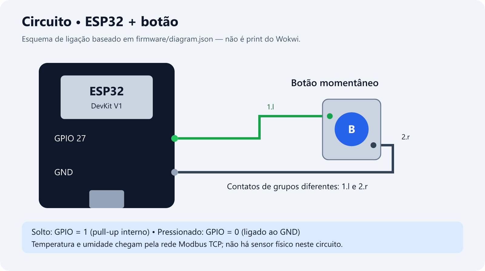
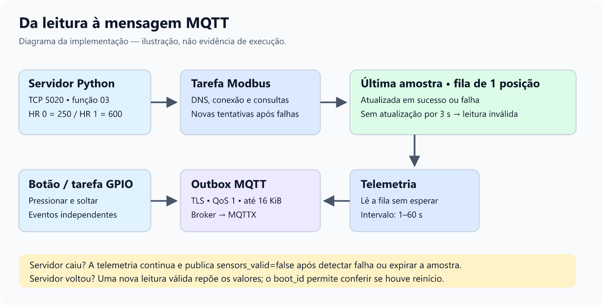

# Telemetria ESP32 MQTT

Comece pelo [manual básico de uso](docs/manual-basico.md): compilação, Wokwi, botão, MQTTX e alteração do intervalo.

Firmware para ESP32 clássico com ESP-IDF 6.1.0, FreeRTOS, MQTT sobre TLS, leitura de temperatura e umidade, eventos de botão e configuração remota do intervalo.

## Funcionalidades

- Telemetria JSON periódica com temperatura, umidade, estado do GPIO 27 e diagnóstico de memória, Wi-Fi e outbox.
- Modo `simulated`, com valores gerados no firmware, e modo `modbus_tcp`, que consulta Holding Registers por Modbus TCP.
- Botão no GPIO 27, ativo em nível baixo, com eventos separados de pressionar e soltar.
- MQTT sobre TLS usando `mqtts://test.mosquitto.org:8886`, conjunto de certificados do ESP-IDF e validação do nome do servidor.
- Outbox MQTT limitado a 16 KiB, com QoS 1, contadores de falhas e expirações.
- Sincronização SNTP antes da conexão MQTT segura, com timeout de 15 segundos.
- Alteração remota do intervalo entre 1.000 e 60.000 ms.

## Hardware e ambiente

O projeto usa ESP32 clássico (`esp32`) e foi compilado com ESP-IDF 6.1.0. A simulação usa Wokwi. O botão deve ser ligado entre o GPIO 27 e GND, em contatos de lados diferentes do componente.



O esquema acima foi desenhado a partir de [`firmware/diagram.json`](firmware/diagram.json); não é uma captura do Wokwi. O botão usa pull-up interno: solto = nível 1; pressionado = nível 0. Temperatura e umidade chegam por Modbus TCP ou são geradas no modo simulado, sem sensores físicos conectados ao circuito.

A configuração padrão usa a rede `Wokwi-GUEST`, sem senha. Para uma placa física, ajuste SSID e senha pelo `idf.py menuconfig` e troque o host Modbus em `firmware/main/app_config.h` pelo IP do computador.

## Compilar e gravar

No PowerShell ESP-IDF:

```powershell
Set-Location firmware
idf.py set-target esp32
idf.py build
idf.py -p COM5 flash monitor
```

Substitua `COM5` pela porta da placa. O arquivo `sdkconfig.defaults` mantém as opções necessárias para reproduzir a configuração sem credenciais reais. A partição de aplicação grande é usada porque o componente Modbus aumenta o firmware.

Para selecionar o modo Modbus, execute `idf.py menuconfig` e habilite **Usar sensores Modbus TCP** em **Configuracao do exemplo**. O modo padrão é `simulated`.

## Wokwi

Abra a pasta `firmware` no VS Code e execute **Wokwi: Start Simulator**. O arquivo `firmware/wokwi.toml` aponta para os artefatos em `firmware/build`. O host `host.wokwi.internal` é usado pelo modo Modbus na rede do Wokwi.

## Simulador Modbus TCP

Na raiz do repositório:

```powershell
py -m venv tools\.venv
.\tools\.venv\Scripts\python.exe -m pip install pyModbusTCP==0.3.0
.\tools\.venv\Scripts\python.exe tools\modbus_server.py --host 0.0.0.0 --port 5020
```

O mapa usa offsets começando em zero:

| Offset | Conteúdo | Exemplo |
| --- | --- | --- |
| `0` | Temperatura × 10 | `250` = 25,0 °C |
| `1` | Umidade × 10 | `600` = 60,0% |

A consulta usa função `03`, unidade `1` e timeout de resposta de 1 segundo. A biblioteca também possui esperas internas de conexão e API; esse timeout não representa o tempo total de uma chamada.

A tarefa Modbus resolve o host, configura os descritores e inicia o mestre com `start_disconnected=true`. Falhas de DNS ou inicialização são tentadas novamente após 2 segundos. Depois de iniciado, o driver TCP cuida da reconexão do mesmo mestre; não se destrói uma consulta em andamento.

As leituras bem-sucedidas são repetidas após 1 segundo; em falha, após 2 segundos. A telemetria consulta uma fila de uma posição sem esperar a rede. Ao detectar falha ou quando a amostra completar 3 segundos sem atualização, publica `sensors_valid: false` e valores numéricos zerados. Esses zeros são placeholders, não medições. Uma leitura bem-sucedida restaura os valores e `sensors_valid: true`.

Para testar a recuperação, mantenha o Wokwi executando, pare apenas o servidor Python com `Ctrl+C`, aguarde pelo menos três publicações e execute o servidor novamente. Confira a sequência `true → false → true`, o mesmo `boot_id` e `uptime_ms` crescente. O procedimento e a situação da validação estão em [`docs/testes.md`](docs/testes.md).

## MQTT

Prefixo do dispositivo: `mathsto19/desafio/esp32-01-7c91`.

| Tópico | Uso |
| --- | --- |
| `.../telemetry` | Telemetria periódica |
| `.../event` | Eventos do GPIO |
| `.../config/set` | Comandos de configuração |
| `.../config/ack` | Confirmações aplicadas |

Exemplo de telemetria:

```json
{
  "type": "telemetry",
  "device_id": "esp32-01-7c91",
  "sensor_mode": "simulated",
  "temperature_c": 25.0,
  "humidity_pct": 60.0,
  "sensors_valid": true,
  "gpio_level": 1,
  "diagnostics": { "interval_ms": 5000 }
}
```

Para alterar o intervalo, publique em `.../config/set`:

```json
{
  "request_id": "teste-01",
  "telemetry_interval_ms": 2000
}
```

O firmware confirma em `.../config/ack` somente depois de aplicar o valor. JSON inválido, fragmentos fora de ordem e valores fora de 1.000–60.000 ms são rejeitados.

## Tarefas e filas

A tarefa de eventos GPIO usa prioridade 5, a tarefa de telemetria usa prioridade 3 e a tarefa de aquisição Modbus usa prioridade 2. O callback do botão monta o evento JSON e o enfileira no outbox MQTT. A telemetria e os ACKs de configuração não aguardam DNS ou consultas Modbus. A fila de configuração tem quatro entradas. O outbox MQTT tem limite de 16 KiB; quando uma mensagem é rejeitada, a perda é contabilizada e o firmware continua funcionando. Reinicializações perdem pendências mantidas em RAM.



## Testes e limitações

Os resultados e os comandos para repetir os testes estão em [`docs/testes.md`](docs/testes.md). Os registros de compilação, testes locais e diagramas estão organizados em [`docs/evidencias/`](docs/evidencias/README.md).

O teste local compila o próprio `sensors.c` com substitutos de FreeRTOS, DNS e ESP-Modbus, exercitando falhas e recuperação. Ele não comprova o comportamento do driver TCP no ESP32, a chegada ao broker nem a recuperação real no Wokwi. Esses resultados ficam separados na tabela de testes; capturas só são registradas quando disponíveis.

## Referências e componentes reaproveitados

- Exemplo oficial [MQTT do ESP-IDF](https://github.com/espressif/esp-idf/tree/master/examples/protocols/mqtt).
- `protocol_examples_common`, usado para conexão Wi-Fi.
- Componente [ESP-Modbus](https://components.espressif.com/components/espressif/esp-modbus), baseado no exemplo `mb_tcp_master`.
- [API oficial do mestre ESP-Modbus](https://docs.espressif.com/projects/esp-modbus/en/main/esp32/master_api_overview.html); a versão resolvida neste projeto está em `firmware/dependencies.lock` (2.1.3 nesta validação).
- Exemplo oficial [SNTP](https://github.com/espressif/esp-idf/tree/master/examples/protocols/sntp).
- Componente [cJSON](https://components.espressif.com/components/espressif/cjson).
- Servidor de teste baseado na API do [pyModbusTCP](https://pymodbustcp.readthedocs.io/en/stable/examples/server.html).

Os avisos de licença dos arquivos derivados do exemplo MQTT foram preservados nos fontes do firmware.
