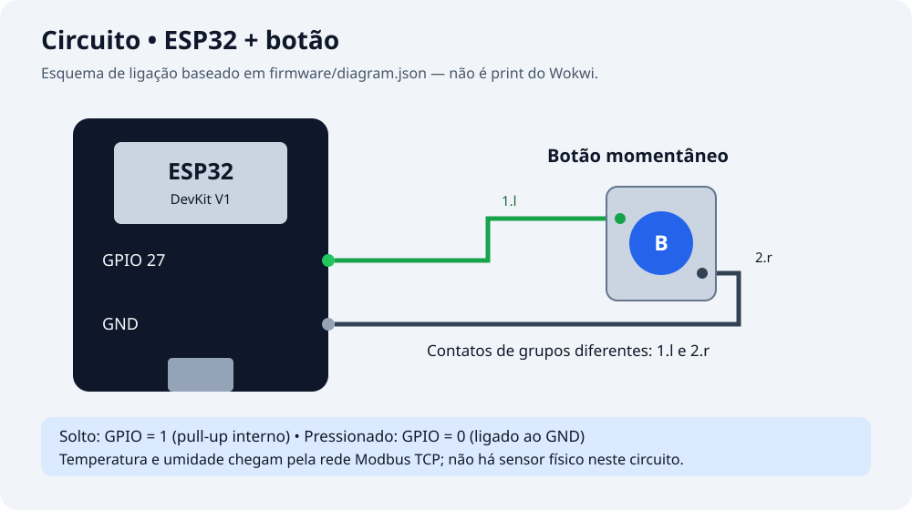
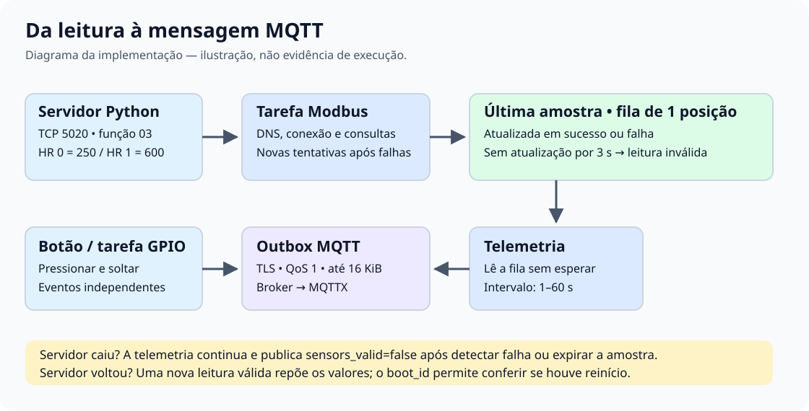

# Registro de testes

Data: 06/09/2026. Ambiente: Windows, ESP-IDF 6.1.0, ESP32 clássico e ESP-Modbus 2.1.3. Os valores de temperatura e umidade são gerados pelo firmware no modo `simulated` ou pelo servidor Python no modo `modbus_tcp`; não são medições de sensores físicos.

## Resultados e alcance

Compilação não comprova execução. Os testes locais abaixo executam o próprio `sensors.c`, substituindo FreeRTOS, DNS e ESP-Modbus por respostas controladas. Não executam o driver TCP do ESP32 nem conectam ao broker.

| Teste | Resultado e evidência |
| --- | --- |
| Compilação Modbus TCP | **Passou.** Firmware gerado com `CONFIG_EXAMPLE_SENSORS_MODBUS_TCP=y`. [Log](evidencias/build-modbus.txt). |
| Compilação modo simulado | **Passou.** Build separado com Modbus desabilitado. [Log](evidencias/build-simulated.txt). |
| Inicialização sem amostra | **Passou no teste local.** Retorna amostra inválida; iniciar os sensores não consulta DNS nem espera servidor. |
| Falha de DNS seguida de recuperação | **Passou no teste local.** Uma tentativa posterior inicia o mestre e obtém valores válidos. |
| Falhas de criação, descritores e início | **Passou no teste local.** Novas tentativas após falha; objetos criados são liberados quando configuração/início falham. |
| Consulta Modbus pendente | **Passou no teste local.** O consumidor lê a fila com espera zero mesmo durante uma chamada de rede simulada. |
| Amostra antiga | **Passou no teste local.** Amostra permanece válida até antes de 3.000 ms e fica inválida ao atingir esse limite. |
| Queda e 30 leituras com erro | **Passou no teste local.** A amostra fica inválida, sem recriação do mestre e sem consulta de rede pelo consumidor. |
| Recuperação com valores novos | **Passou no teste local.** Após as falhas, retorna 31,0 °C e 72,5%, substituindo os valores anteriores de 25,0 °C e 60,0%. |
| Falha ao liberar mestre | **Passou no teste local.** Não reutiliza objeto parcialmente destruído. Essa falha interna suspende a reinicialização do mestre; a telemetria continua inválida. |
| Modo simulado | **Passou no teste local.** Duas voltas do ciclo de 20 leituras com valores limitados. |
| Queda/retorno do servidor no Wokwi, sem reiniciar | **Pendente de execução registrada no VS Code.** Teste local não comprova essa recuperação real. |
| Botão no Wokwi | O registro anterior informa detecção de pressionar/soltar no GPIO 27. Captura não estava disponível; repetir durante a queda do Modbus. |
| MQTT, telemetria e ACK de configuração | **Pendente de evidência de execução nesta revisão.** Conferir mensagens no MQTTX durante a queda e após o retorno. |
| Wi-Fi interrompido/restaurado | **Não executado nesta revisão.** A configuração do outbox não comprova retransmissão em rede real. |
| Outbox cheio e certificado inválido | **Não executado nesta revisão.** Tratamentos presentes no código não equivalem a teste experimental. |
| JSON de configuração inválido | **Inspeção de código apenas nesta revisão.** Repetir com JSON malformado e intervalo fora de 1.000–60.000 ms. |
| Execução contínua de 30 minutos | **Não executada nesta revisão.** Registrar duração, heap e reinicializações antes de afirmar estabilidade prolongada. |

Os resultados locais detalhados estão em [testes-sensores.txt](evidencias/testes-sensores.txt).

## Correção aplicada

Antes, `sensores_ler()` fazia a consulta TCP dentro da tarefa de telemetria e mantinha um mutex durante a espera. Na versão local analisada, a inicialização usava `start_disconnected=false` e uma falha inicial podia deixar o mestre indisponível sem novas tentativas.

Agora, uma tarefa de aquisição com prioridade 2 cuida do DNS e Modbus. A telemetria, de prioridade 3, apenas lê uma fila de uma posição, com espera zero. Erros substituem a amostra por uma inválida; amostras sem atualização por 3 segundos também são inválidas. O timeout de resposta é de 1 segundo, mas as esperas internas de conexão/API podem durar mais. Elas ficam fora da tarefa de telemetria.

O mestre inicia desconectado, com os descritores registrados e endereço `UID;IPv4;PORTA`. Falhas de DNS/inicialização recebem novas tentativas após 2 segundos, exceto falha interna de limpeza, que impede reutilização insegura do objeto. Após o início, a reconexão TCP é responsabilidade do driver; o firmware repete a leitura sem destruir a stack a cada erro.

## Repetir os testes locais

Na raiz do repositório:

```powershell
py -m venv tools\.venv-test
.\tools\.venv-test\Scripts\python.exe -m pip install ziglang==0.14.1
.\tools\.venv-test\Scripts\python.exe tools\test_sensors.py
.\compilar.ps1
```

O teste C é compilado com `-Wall -Wextra -Werror`. Os substitutos não simulam concorrência real, temporizadores do ESP32 ou pacotes TCP; verificam as transições e o contrato de leitura sem espera.

Para compilar o modo simulado separadamente, no terminal ESP-IDF e na raiz do repositório:

```powershell
New-Item -ItemType Directory -Force build/simulated | Out-Null
$configTeste = Join-Path $PWD 'build/simulated/sdkconfig'
idf.py -C firmware -B build/simulated -D "SDKCONFIG=$configTeste" build
```

Esse diretório usa `sdkconfig.defaults`, cujo modo padrão é simulado. O firmware Modbus para o teste Wokwi permanece em `firmware/build`.

## Teste de queda e recuperação no Wokwi

1. Habilitar Modbus TCP no `menuconfig`, compilar e iniciar o servidor:

   ```powershell
   .\tools\.venv\Scripts\python.exe tools\modbus_server.py --host 0.0.0.0 --port 5020
   ```

2. Abrir `firmware` no VS Code e executar **Wokwi: Start Simulator**. Aguardar `Modbus disponivel/recuperado` e telemetria com `sensors_valid=true`, 25,0 °C e 60,0%. Registrar `boot_id` e `uptime_ms`.
3. Parar **somente o servidor Python**, usando `Ctrl+C` no terminal dele. Manter o Wokwi executando. Aguardar pelo menos três telemetrias com `sensors_valid=false`; os valores zerados indicam indisponibilidade, não medições.
4. Pressionar e soltar o botão durante a queda. Conferir os eventos no monitor e em `.../event` no MQTTX. Publicar a configuração abaixo em `mathsto19/desafio/esp32-01-7c91/config/set` e conferir ACK em `.../config/ack`:

   ```json
   { "request_id": "queda-modbus-01", "telemetry_interval_ms": 2000 }
   ```

5. Executar novamente o mesmo comando do servidor Python, **sem reiniciar a simulação**. Esperar a leitura e a telemetria voltarem a `sensors_valid=true`.
6. Repetir a queda/retorno duas vezes. Salvar o trecho contínuo do monitor e as capturas em `docs/evidencias/`, conforme o [índice](evidencias/README.md).
7. Fazer também uma execução iniciando o Wokwi com o servidor desligado; ligar apenas o servidor depois e verificar recuperação.

Critérios de aprovação: sequência `true → false → true`; mesmo `boot_id`; uptime crescente; telemetria e eventos continuam durante a queda; ACK aplicado; ausência de panic, watchdog ou reset. Registrar o tempo observado entre religar o servidor e a primeira telemetria válida, sem confundir esse tempo com o timeout de resposta.

Se o servidor responde no computador, mas não no Wokwi, verificar se o gateway da extensão está ativo e se o acesso a `host.wokwi.internal:5020` está disponível. Um teste de cliente Modbus no computador, sozinho, não valida o caminho de rede da simulação.

## Evidências visuais





Os dois arquivos são diagramas explicativos, não prints de execução. Capturas reais e resultados informados pelo operador devem ser identificados separadamente, com data e contexto do teste.
